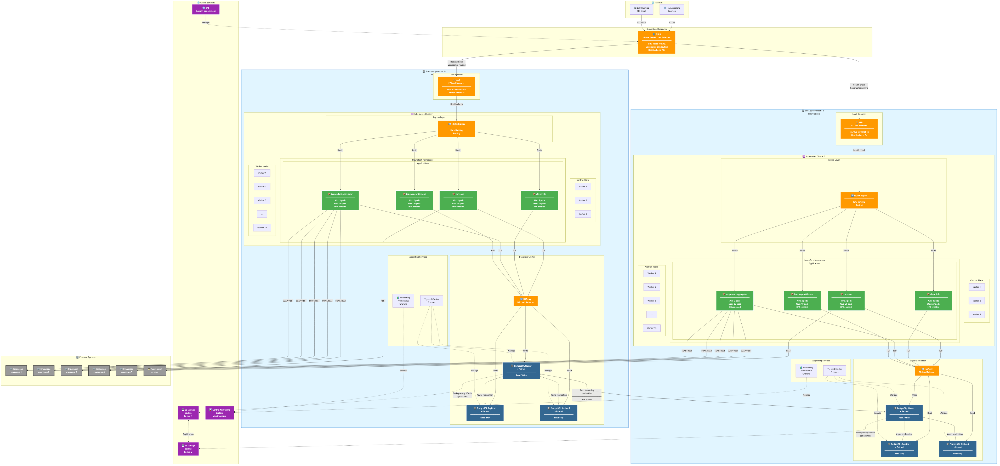
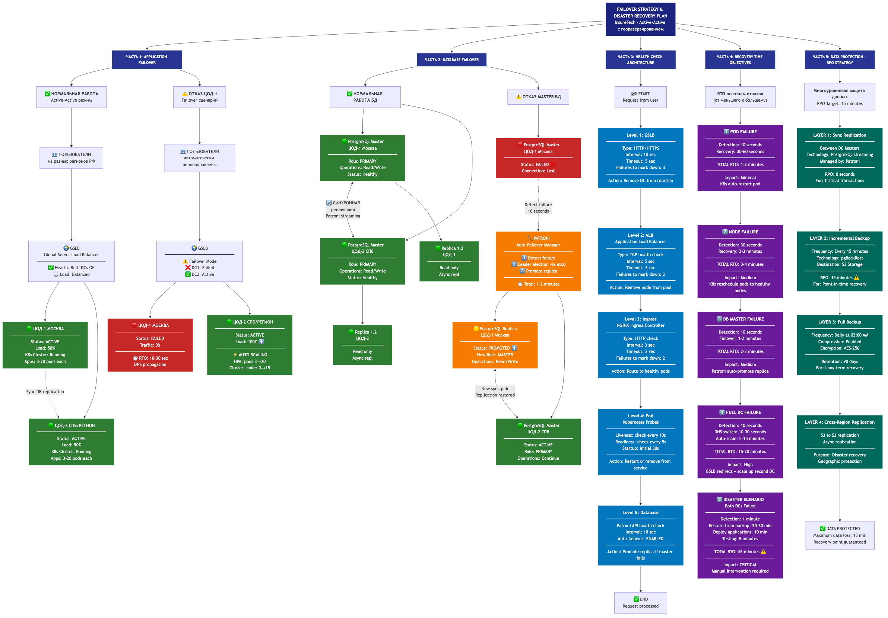

# Задание 1: Проектирование технологической архитектуры InsureTech

## 📋 Содержание решения

Данная директория содержит решение задания 1 по проектированию технологической архитектуры системы InsureTech с требованиями:
- **Доступность**: 99,9%
- **RTO**: 45 минут
- **RPO**: 15 минут
- **Масштабирование**: поддержка роста нагрузки и географическое распределение

## 📁 Файлы решения

### 1. Архитектурное решение (текстовое описание)
**Файл**: `Архитектурное_решение.md`

Подробное описание архитектурных решений с обоснованием выбора:
- Анализ требований и выбор фейловер-стратегии
- Конфигурация Kubernetes кластеров (независимые кластеры в каждой зоне)
- Многоуровневая балансировка нагрузки (GSLB, ALB, Ingress)
- Стратегия масштабирования (HPA, Cluster Autoscaler)
- Конфигурация БД с PostgreSQL Patroni
- Disaster Recovery Plan
- Мониторинг и безопасность

### 2. Схема архитектуры (визуализация)
**Файлы**: 
- `architecture_diagram.mmd` - исходный код Mermaid
- `architecture_diagram.png` - скомпилированная диаграмма

**Диаграмма включает**:
- 2 зоны доступности (Москва, СПб/регион)
- Независимые Kubernetes кластеры в каждой зоне
- GSLB для географической балансировки
- Полную конфигурацию приложений с HPA
- PostgreSQL Patroni кластеры с репликацией
- Внешние интеграции (страховые компании, платежный сервис)
- Health check на всех уровнях



### 3. Схема фейловер-стратегии
**Файлы**:
- `failover_strategy.mmd` - исходный код Mermaid
- `failover_strategy.png` - скомпилированная диаграмма

**Диаграмма показывает**:
- Нормальную работу в режиме Active-Active
- Сценарий отказа одной зоны доступности
- Автоматический failover базы данных через Patroni
- Архитектуру health checks на всех уровнях
- RTO для различных сценариев отказа
- Стратегию защиты данных (RPO)



## 🎯 Ключевые архитектурные решения

### 1. Фейловер-стратегия: Active-Active с георезервированием
**Обоснование**:
- Требования доступности 99,9% и RTO 45 минут соответствуют критериям Active-Active
- Минимальное время простоя (стремится к нулю)
- Равномерное время отклика для пользователей из всех регионов РФ

### 2. Независимые Kubernetes кластеры
**Обоснование**:
- Изоляция сбоев - отказ в одном кластере не влияет на другой
- Снижение зависимости от сетевой связности между ЦОД
- Упрощение управления и независимые обновления

### 3. Многоуровневая балансировка
- **GSLB**: географическое распределение трафика, health check зон
- **ALB**: L7 балансировка, SSL/TLS termination
- **Ingress**: маршрутизация приложений, rate limiting
- **Service**: балансировка между подами

### 4. PostgreSQL Patroni
**Конфигурация**:
- Master + 2 Replica в каждой зоне
- Синхронная репликация между Master узлами разных зон
- Автоматический failover через Patroni (RTO: 1-2 минуты)
- Инкрементные бэкапы каждые 15 минут (RPO: 15 минут)

### 5. Шардирование БД
**Решение**: НЕ применять на текущем этапе
- Текущий объем 50 GB легко обрабатывается одним кластером
- Рассмотреть при достижении 500+ GB

### 6. Автомасштабирование
- **HPA**: масштабирование подов по CPU (70%), Memory (80%), RPS (100/pod)
- **Cluster Autoscaler**: масштабирование узлов кластера (3-15 нод)

## 📊 Ожидаемые результаты

### Доступность
- **Целевая**: 99,9% (8.76 часов простоя в год)
- **Фактическая ожидаемая**: 99,95%+ (благодаря Active-Active)

### Производительность
- **Latency**: p95 < 200ms для всех регионов
- **RPS**: до 1000+ RPS с автомасштабированием
- **Scalability**: до 20 подов на сервис

### Отказоустойчивость
- **RTO**: 
  - Отказ пода: 30-60 секунд
  - Отказ узла: 2-3 минуты
  - Отказ Master БД: 1-2 минуты
  - Отказ зоны: 10-30 секунд (DNS propagation)
  - Катастрофа (обе зоны): до 45 минут
- **RPO**: максимум 15 минут
- **Failover**: автоматический в большинстве случаев

## 🔧 Технологический стек

### Оркестрация и контейнеризация
- Kubernetes (multi-master: 3 узла)
- Docker

### Балансировка
- GSLB (Global Server Load Balancer)
- Application Load Balancer (L7)
- NGINX Ingress Controller
- HAProxy (для БД)

### База данных
- PostgreSQL 14+
- Patroni (HA решение)
- etcd (координация)
- pgBackRest (бэкапы)

### Хранение
- S3-совместимое хранилище (бэкапы)

### Мониторинг и наблюдаемость
- Prometheus (метрики)
- Grafana (визуализация)
- Alertmanager (алерты)
- Loki (логи)
- Jaeger (трейсинг)

### Автомасштабирование
- Horizontal Pod Autoscaler (HPA)
- Cluster Autoscaler
- Metrics Server

## 🔒 Безопасность

### Network Security
- VPN туннели между ЦОД
- Firewall rules
- DDoS protection на уровне GSLB и ALB

### Application Security
- TLS/SSL для всего трафика
- Kubernetes Secrets + External Secrets Operator
- RBAC для доступа

### Data Security
- Encryption at rest (диски БД)
- Encrypted backups
- Compliance с требованиями по защите персональных данных

## 🎨 Как открыть диаграммы

### Просмотр PNG
Откройте файлы `architecture_diagram.png` и `failover_strategy.png` в любом графическом редакторе или браузере.

### Редактирование Mermaid
1. Откройте файлы `.mmd` в текстовом редакторе
2. Для визуализации используйте:
   - [Mermaid Live Editor](https://mermaid.live/)
   - VSCode с расширением Mermaid
   - Любой Markdown редактор с поддержкой Mermaid

### Компиляция из исходников
```bash
# Установка mermaid-cli (если нужно)
npm install -g @mermaid-js/mermaid-cli

# Компиляция
mmdc -i architecture_diagram.mmd -o architecture_diagram.png -b transparent -w 3840 -H 2160
mmdc -i failover_strategy.mmd -o failover_strategy.png -b transparent -w 3840 -H 2160

# Или через npx (без установки)
npx -y @mermaid-js/mermaid-cli -i architecture_diagram.mmd -o architecture_diagram.png
```

## 📚 Использованные материалы теории

Решение основано на изученной теории:
- **Фейловер-стратегии**: создание и типы (Active-Active, Active-Standby, георезервирование)
- **Kubernetes масштабирование**: HPA, VPA, Cluster Autoscaler
- **PostgreSQL Patroni**: конфигурация HA кластеров с автоматическим failover
- **GSLB**: географическая балансировка нагрузки
- **RTO/RPO**: обеспечение требований восстановления и защиты данных

## ✅ Соответствие требованиям задания

✅ Спроектирована технологическая архитектура с учетом требований бизнеса  
✅ Определена фейловер-стратегия Active-Active с георезервированием  
✅ Использованы 2 зоны доступности для отказоустойчивости  
✅ Проработана конфигурация Kubernetes (независимые кластеры)  
✅ Спланирована многоуровневая балансировка с health checks  
✅ Определена конфигурация БД с Patroni (репликация + бэкапы)  
✅ Обосновано решение по шардированию (не применять на текущем этапе)  
✅ Схемы отражают все компоненты и взаимодействия  
✅ Добавлены комментарии с объяснением решений  

## 🚀 Следующие шаги

После утверждения архитектуры:
1. Разработка инфраструктурного кода (Terraform/Helm charts)
2. Настройка CI/CD пайплайнов
3. Разработка runbook'ов для операционной команды
4. Проведение тестирования отказоустойчивости
5. Настройка мониторинга и алертинга
6. Обучение команды DevOps
